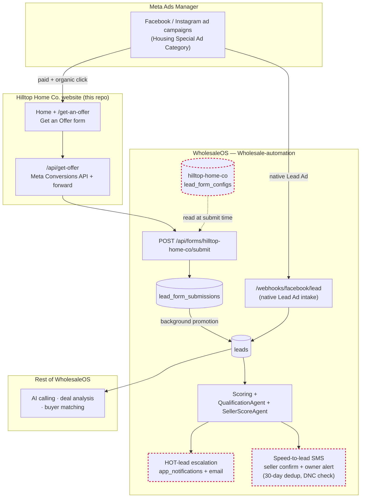

# Hilltop Home Co.

Marketing/lead-gen website for Hilltop Home Co., a DFW motivated-seller home-buying business.
Built with Next.js (App Router) + Tailwind.

## Development

```bash
npm install
npm run dev       # http://localhost:3000
npm run typecheck
npm run lint
npm run build
```

Copy `.env.example` to `.env.local` and fill in the values (WholesaleOS API base URL, Meta
Pixel ID/token, owner phone number) to enable form submission and Pixel tracking locally.

## Lead pipeline — WholesaleOS integration

This site does not own any database or backend of its own. The "Get an Offer" form submits to
`src/app/api/get-offer/route.ts`, a thin server-side proxy that:

1. Forwards the submission to **WholesaleOS** (`julysses/Wholesale-automation`), the business's
   existing CRM/automation platform — specifically its live FastAPI endpoint
   `POST {WHOLESALE_API_BASE}/api/forms/hilltop-home-co/submit`. WholesaleOS owns lead storage,
   scoring, qualification, and SMS/email notifications from there.
2. Fires the Meta Conversions API `Lead` event server-side (best-effort), using the same
   `landing_page_url`/UTM data captured from the form.
3. Returns WholesaleOS's response (including its configured `thank_you_message`) back to the
   client for the confirmation screen.

The form's fields (`property_address`, `first_name`, `last_name`, `phone`, `email`,
`motivation`, `timeline`, `condition`, `occupancy`, `asking_price`, `sms_opt_in` — see
`src/lib/constants.ts`) intentionally match the field names/values WholesaleOS's
`lead_form_configs`/scoring pipeline expects, so submissions score correctly with zero backend
code changes. The corresponding `hilltop-home-co` form config, plus a WholesaleOS-side fix for
real speed-to-lead SMS (confirmation to the seller + immediate owner alert on every lead), were
added on a `feat/hilltop-home-co-integration` branch in the `Wholesale-automation` repo — that
branch has not been merged/deployed and needs review before this form goes live in production.

`WHOLESALE_API_BASE` defaults to `https://wholesale-automation.vercel.app` — the live WholesaleOS
deployment.

### Architecture diagram

How a lead reaches the team, from either Facebook Ads or this website. Dashed red nodes are on
the unmerged `feat/hilltop-home-co-integration` branch in `Wholesale-automation` — not yet live.


