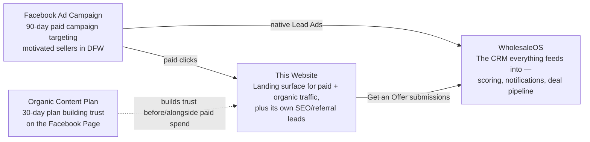
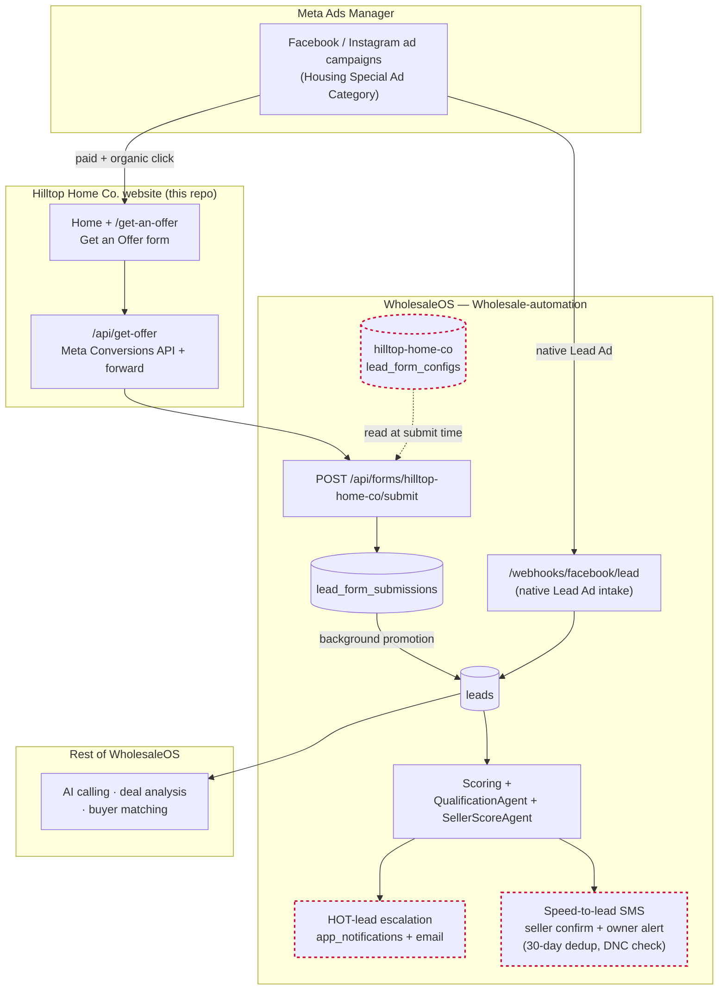

# Hilltop Home Co.

Marketing/lead-gen website for Hilltop Home Co., a DFW motivated-seller home-buying business.
Built with Next.js (App Router) + Tailwind.

## How the system fits together

This site is one of four pieces of the overall lead-generation system: a paid ad campaign and an
organic content plan both drive traffic (directly to WholesaleOS, or through this site), and every
lead — however it arrives — ends up in WholesaleOS, the CRM that scores it, notifies the team, and
carries it through the rest of the deal pipeline.



See "Architecture diagram" below for how a submission actually moves through the system.

## Development

```bash
npm install
npm run dev       # http://localhost:3000
npm run typecheck
npm run lint
npm run build
```

Copy `.env.example` to `.env.local` and fill in the values (WholesaleOS API base URL, Meta
Pixel ID/token, owner phone number) to enable form submission and Pixel tracking locally.

## Deploying (Netlify)

This site is not purely static — `src/app/api/get-offer/route.ts` is a server-side Route Handler
and `icon.tsx`/`apple-icon.tsx` code-generate the favicon via `next/og`. Netlify serves these
through its official Next.js Runtime, declared in `netlify.toml`:

```toml
[build]
  command = "npm run build"

[[plugins]]
  package = "@netlify/plugin-nextjs"
```

To go live:

1. In the Netlify dashboard: **Add new site → Import an existing project → GitHub** → select
   `julysses/HilltopHome`, branch `claude/hilltop-home-website-3yc224`. The build command and
   plugin are already configured via `netlify.toml` — no manual build settings needed.
2. Set these environment variables under **Site settings → Environment variables** (same values
   as `.env.example`):
   - `NEXT_PUBLIC_SITE_URL` — `https://hilltophome.co`
   - `WHOLESALE_API_BASE` — `https://wholesale-automation.vercel.app` (**required**, no code
     fallback — the Get an Offer form won't have anywhere to submit to without it)
   - `NEXT_PUBLIC_META_PIXEL_ID` / `META_CONVERSIONS_API_TOKEN` — optional, Pixel tracking no-ops
     gracefully without them
   - `NEXT_PUBLIC_OWNER_PHONE_DISPLAY` / `NEXT_PUBLIC_OWNER_PHONE_TEL` — optional, falls back to
     the placeholder `(214) 555-0100`
3. Attach the custom domain under **Site settings → Domain management → Add a domain** →
   `hilltophome.co`, then add whatever DNS records Netlify's UI displays at your registrar.

## Lead pipeline — WholesaleOS integration

This site does not own any database or backend of its own. The "Get an Offer" form submits to
`src/app/api/get-offer/route.ts`, a thin server-side proxy that:

1. Forwards the submission to **WholesaleOS** (`julysses/Wholesale-automation`), the business's
   existing CRM/automation platform — specifically its live FastAPI endpoint
   `POST {WHOLESALE_API_BASE}/api/forms/hilltop-home-co/submit`. WholesaleOS owns lead storage,
   scoring, qualification, and SMS/email notifications from there.
2. Fires the Meta Conversions API `Lead` event server-side (best-effort), using the same
   `landing_page_url`/UTM data captured from the form.
3. Returns WholesaleOS's response (including its configured `thank_you_message`) back to the
   client for the confirmation screen.

The form's fields (`property_address`, `first_name`, `last_name`, `phone`, `email`,
`expected_range`, `motivation`, `timeline`, `condition`, `occupancy`, `sms_opt_in` — see
`src/lib/constants.ts`) intentionally match the field names/values WholesaleOS's
`lead_form_configs`/scoring pipeline expects, so submissions score correctly with zero backend
code changes. The corresponding `hilltop-home-co` form config, plus a WholesaleOS-side fix for
real speed-to-lead SMS (confirmation to the seller + immediate owner alert on every lead), were
added on a `feat/hilltop-home-co-integration` branch in the `Wholesale-automation` repo — that
branch has not been merged/deployed and needs review before this form goes live in production.

`WHOLESALE_API_BASE` defaults to `https://wholesale-automation.vercel.app` — the live WholesaleOS
deployment.

### Architecture diagram

How a lead reaches the team, from either Facebook Ads or this website. Dashed red nodes are on
the unmerged `feat/hilltop-home-co-integration` branch in `Wholesale-automation` — not yet live.


